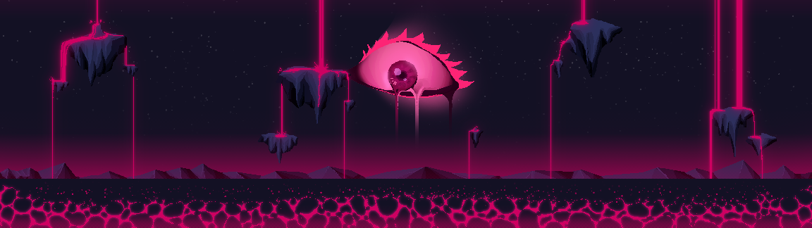
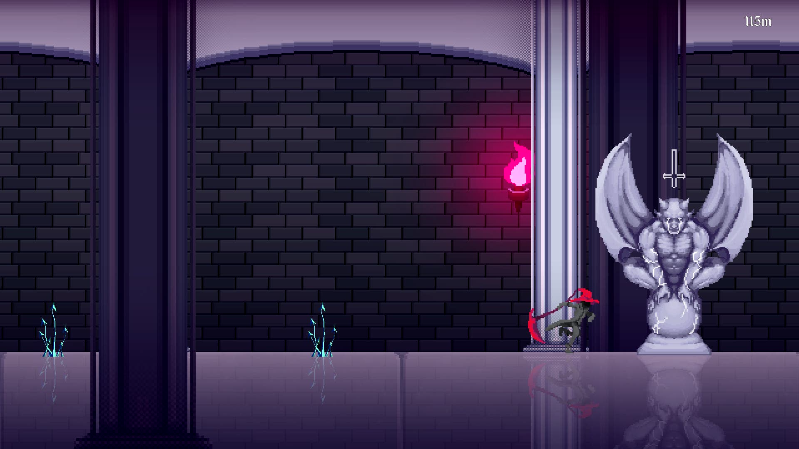

# UNHALLOWED


## Descrição

**Unhallowed** é um jogo 2D de runner, bullet hell e plataforma, com narrativa visual novel, desenvolvido em pixel art com atmosfera sombria. O jogador controla uma alma perdida, recém-chegada ao limbo após uma morte acidental e humilhante. Sem memórias e tomado por raiva, recebe uma proposta de Caronte: eliminar os guardiões dos círculos do inferno para ganhar uma nova chance de retornar e buscar vingança.

Inspirado na obra de **Dante Alighieri**, *Unhallowed* oferece gameplay frenético e decisões narrativas, criando uma experiência única para fãs de ação e histórias envolventes.

---

## Trailer

[](https://www.youtube.com/watch?v=j1d20r_YIMI)

---

## Imagens




---

## Instalação, Execução e Download

### Jogue Agora

O Unhallowed está disponível gratuitamente para **Windows**, **Mac** e **Android**.  
Acesse a página oficial do projeto no Itch.io para baixar e jogar:

[➡️ Jogar Unhallowed no Itch.io](https://calliari.itch.io/unhallowed)

### Instalação Local (para desenvolvedores)

#### Pré-requisitos

- **Plataformas suportadas:** Windows, Mac, Android
- **Engine:** Godot
- **Requisitos mínimos:**  
  - CPU Dual-Core  
  - 2GB RAM  
  - Placa de vídeo integrada  
  - 100MB de espaço livre  

#### Passos para rodar localmente

1. Clone o repositório:
   ```bash
   git clone https://github.com/dcalliari/UNHALLOWED.git
   ```
2. Abra o projeto na engine Godot (versão recomendada 3.5 ou superior).
3. Compile ou execute o jogo via editor da engine.

---

## Controles

- `W` ou `Espaço` — Pular (segurar para salto alto)
- `A` e `D` — Movimentação lateral
- `K` ou botão esquerdo do mouse — Ataque
- `L` ou botão direito do mouse — Habilidade especial

---

## Mecânicas Principais

- **Runner Side-Scrolling:** Movimento automático, com opções de desacelerar, pular e desviar de obstáculos.
- **Bullet Hell:** Enfrente padrões intensos de projéteis e inimigos constantes.
- **Plataforma:** Pule entre plataformas, armadilhas e obstáculos dinâmicos.
- **Visual Novel:** Diálogos interativos entre fases, influenciando a narrativa e desbloqueando caminhos alternativos.

---

## Estrutura de Fases

O jogo é dividido em mundos baseados nos círculos do inferno, cada um com 5 fases (sendo a última uma boss fight única):

1. **Luxúria:** Ventos eternos. Mecânica de manter a temperatura corporal controlada.
2. **Ganância:** Calor extremo. É necessário quebrar frascos de gelo para sobreviver.
3. **Ira:** Quantidade de inimigos aumenta conforme o progresso.
4. **Violência:** Combinação de calor, hordas de inimigos e obstáculos complexos.

---

## Personagens

### 🔥 UNHALLOWED (Protagonista)
- **Arquétipo:** Herói Relutante
- Uma alma sem memórias da vida, marcada apenas pela vergonha de sua morte. Busca redenção e vingança.
- Empunha a **Foice Carmesim**, presenteada pela Morte.

### 🪦 CARONTE (Mentor)
- **Arquétipo:** Mentor disfuncional
- Representação cínica da Morte, aparece como um chapéu falante.
- Manipula o protagonista para cumprir suas tarefas e abandona seu papel tradicional.

### 🩸 BATHORY (Antagonista)
- **Arquétipo:** A Sombra
- Guardiã do sétimo círculo, ex-nobre sádica com planos de dominar o limbo.
- Tenta corromper o protagonista com promessas de poder e lembranças.

---

## Tecnologias e Ferramentas

- **Engine:** Godot
- **Linguagem Principal:** GDScript (Godot)
- **Arte:** Pixel art original, atmosfera sombria
- **Trilha sonora:** Rock/Metal atmosférico, inspirado em *Metal: Hellsinger* e *Guilty Gear Xrd*
- **Narrativa:** Diálogos estilo visual novel (*Neon White*)

---

## Desenvolvimento

Projeto criado originalmente para a disciplina de **Game Engine**.  
Este repositório contém a versão jogável, assets, código fonte e arquivos do projeto.  
Todos os elementos - personagens, lore e mecânicas - foram desenvolvidos para garantir coesão narrativa e identidade estética.

---

## Contribuições

Contribuições são bem-vindas!  
Para sugerir melhorias, relatar bugs ou novas ideias:

1. Abra uma *issue* descrevendo sua proposta.
2. Faça um *fork* do repositório.
3. Crie uma branch para sua feature ou correção.
4. Envie um *pull request* detalhando as alterações.

---

## Licença

Este repositório é destinado exclusivamente para fins acadêmicos, não devendo ser utilizado para fins comerciais.

---

## Contato

Dúvidas ou sugestões? Abra uma issue ou entre em contato pelo [perfil do autor](https://github.com/dcalliari).

---